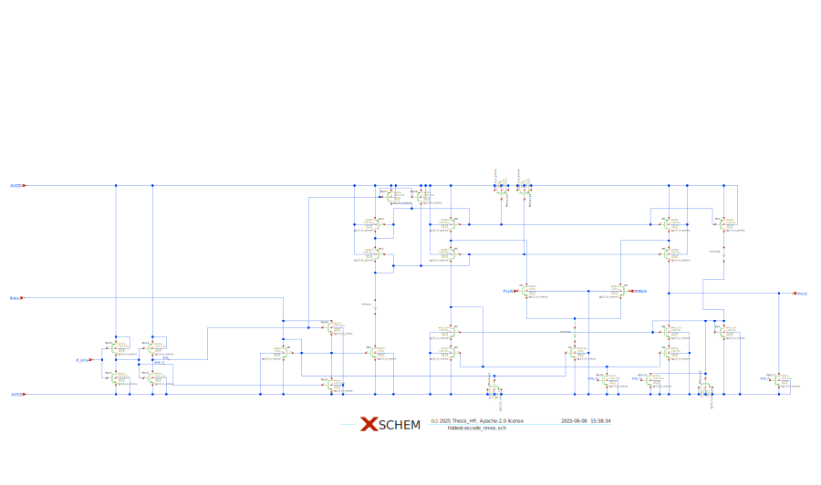

Design data and design process description
############################################

Document the design process here and comment on the design data. 

Into the Design
===============

.. image:: _static/_fig_foldedcascode_diagram.svg
   :align: center
   :alt: Folded Cascode OTA Diagram
   :width: 600

As shown in the :ref:`fig-foldedcascode-diagram`, :math:`M_1` and :math:`M_2` are the input differential pair MOSFETs, with :math:`M_5, M_6` and :math:`M_7, M_8` acting as their cascode devices.

.. important:: **Cascode Bias Voltage Generation**

   It is critically important for stable performance across PVT that the bias voltages for the cascode gates are generated in a manner that **tracks variations** with process, temperature, and supply voltage!

The current mirror constructed from :math:`M_{3,7}` and :math:`M_{4,8}` is a special type of **cascode current mirror** for low-voltage operation, also known as a **high-swing cascode current mirror**. This configuration is commonly used, as it ensures that the :math:`V_{GS}` and :math:`V_{DS}` of :math:`M_3` and :math:`M_4` are equal, making the current mirror ratio **independent of** :math:`g_{ds}`.

This structure is referenced from Jespers and Murmann [#JespersMurmann]_.

Complete Design and Constant :math:`g_m` Biasing Using Current Mirrors
=======================================================================

Based on the sizing procedure using `gmid-method`, we now have all the :math:`W/L` ratios and are ready to design the complete OTA (see :ref:`fig-foldedcascode-xschem`).

.. _fig-foldedcascode-xschem:

-  OTA design in Xschem

Discussion of the OTA Design
----------------------------

We will now analyze the circuit design of the OTA, including practical considerations and implementation challenges:

1. For easier navigation, the device identifiers are consistent with the circuit sketch in :ref:`fig-foldedcascode-xschem`.

2. Some MOSFET dimensions are rounded for better fit in the IC layout. Pay close attention to :math:`W`, :math:`L`, and :math:`\mathrm{ng}`.  
   The parameter :math:`\mathrm{ng}` defines how the total width :math:`W` of a MOSFET is split into individual fingers:  
   :math:`W_\mathrm{f} = \frac{W}{\mathrm{ng}}`.  
   This is done to arrive at a suitable physical implementation.

3. The circuit is carefully drawn for readability. Important nets are named, and text comments indicate nominal voltage levels, bias currents, and other key properties.  
   Current sensing elements are included to allow direct observation of DC currents during simulation.

4. The bias voltage generation for cascodes is included.  
   The voltage drop for the bottom transistors is developed by properly scaling MOSFETs in the reference branch.  
   Specifically, reducing the :math:`W/L` ratio increases :math:`V_{GS}` to provide sufficient headroom for bottom MOSFET operation.

5. Sensitive bias nodes are buffered using decoupling capacitors.  
   We use MOSFETs as nonlinear capacitors to increase capacitive density—acceptable in this application.  
   Note how some MOSFET capacitors are connected to :math:`V_{DD}`, while others are tied to :math:`V_{SS}`.

.. [#JespersMurmann] Jespers & Murmann, *Analysis and Design of Analog Integrated Circuits*, 2017.

