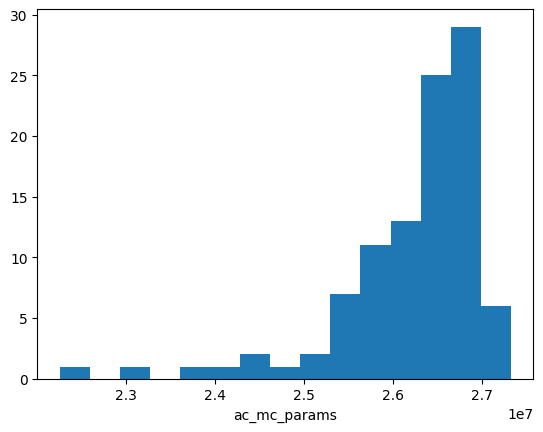

Validation  of the Amazing Design
#################################

Simulation of the OTA
=====================

Now that the circuit is finalized, we proceed to test its **AC behavior**, **transient response**, and **loop gain** using both **Middlebrook's** and **Tian's** methods, as illustrated in the following figures:

-  AC Analysis

-  Transient Analysis

-  Loop Gain Testbench Setup

The loop gain analysis yields the following plots, which confirm that the design meets the required **gain** and **phase margin** specifications. These include plots from both **Middlebrook's** and **Tian's** loop-gain extraction techniques.

-  Loop Gain - Magnitude: Middlebrook vs Tian

-  Loop Gain - Phase: Middlebrook vs Tian

Corner Simulations for PVT and Monte Carlo
==========================================

As described earlier, running simulations manually is impractical when validating the design across varying conditions. To ensure robustness, we perform extensive simulation across:

1. **Supply Voltage Variation**  
   The power supply may vary due to tolerances, so we must evaluate performance across voltage ranges.

2. **Temperature Variation**  
   Since ICs operate under different environmental conditions, we test over a wide temperature range.

3. **Process Variation (PVT Corners)**  
   Manufacturing variations affect device parameters. Foundries provide model files for corner analysis:
   
   - **SS**: Slow NMOS, Slow PMOS  
   - **SF**: Slow NMOS, Fast PMOS  
   - **TT**: Typical NMOS, Typical PMOS  
   - **FS**: Fast NMOS, Slow PMOS  
   - **FF**: Fast NMOS, Fast PMOS  

So far, simulations have used only the **TT** model. To validate the full design, all **PVT** corners and relevant **input conditions** must be covered.

This leads to a large set of simulations, which must be automatically evaluated for **pass/fail criteria** across specs like gain, bandwidth, and phase margin.

PVT and Monte Carlo Summary for foldedcascode_ota
==================================================

.. table:: CACE Summary Parameters
   :widths: 20 10 10 10 10 10 10 10 10 10
   :align: center

   =======================  ========  ========  =========  =========  =========  =========  =========  =========  =======
   Parameter                Tool      Result    Min Limit  Min Value  Typ Target Typ Value  Max Limit  Max Value  Status
   =======================  ========  ========  =========  =========  =========  =========  =========  =========  =======
   Output voltage ratio     ngspice   gain      0.98 V/V   0.996 V/V  any        0.999 V/V  1.1 V/V    1.000 V/V  Pass ✅
   Bandwidth                ngspice   bw        1e6 Hz     5118320 Hz any        7827360 Hz any        13271000 Hz Pass ✅
   Output voltage ratio (MC)ngspice   gain_mc   any        0.671 V/V  any        0.996 V/V  any        1.502 V/V  Pass ✅
   Bandwidth (MC)           ngspice   bw_mc     1e6 Hz     1024950 Hz any        7454465 Hz any        91913200 Hz Pass ✅
   Output noise             ngspice   noise     any        0.069 mV   any        0.101 mV   0.2 mV     0.134 mV   Pass ✅
   Settling time            ngspice   tsettle   any        0.259 us   any        0.287 us   1.5 us     0.320 us   Pass ✅
   =======================  ========  ========  =========  =========  =========  =========  =========  =========  =======

   Gain vs Temperature

-  Gain vs Input Voltage

-  Gain vs Supply Voltage

-  Gain vs Corner

-  Bandwidth vs Temperature

.. image:: _static/schematic/bw_vs_vin.png
   :align: center
   :alt: Bandwidth vs Input Voltage
   :width: 600

-  Bandwidth vs Input Voltage

-  Bandwidth vs Supply Voltage

-  Bandwidth vs Corner

-  Gain Monte Carlo

-  Bandwidth Monte Carlo

-  Noise vs Temperature

-  Noise vs Input Voltage

.. image:: _static/noise_vs_vdd.png
   :align: center
   :alt: Noise vs Supply Voltage
   :width: 600

-  Noise vs Supply Voltage

-  Noise vs Corner

-  Settling Time vs Temperature

-  :width: 600

   Settling Time vs Input Voltage

-  Settling Time vs Supply Voltage

-  Settling Time vs Corner

.. table:: OTA Specifications
   :align: center

   ================================================ =========== ===========
   **Specification**                                **OTA**     **Unit**
   ================================================ =========== ===========
   Output voltage error                             :math:`<1`  %
   Total output noise (rms)                         :math:`<0.15` mV rms
   Supply current (as low as possible)              :math:`<12.5` µA
   Turn-on time                                     :math:`<0.4`  µs
   Externally provided bias current (nominal)       :math:`14`  µA
   ================================================ =========== ===========

